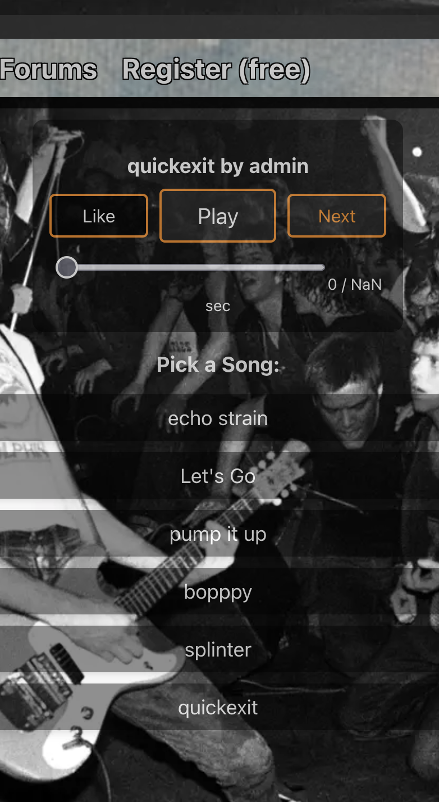

# GothamSonic Music Player 🎵

### 📸 Screenshot

A professional-grade React music player built with adaptive bitrate streaming via `hls.js`. Actively powering the live music experience on [GothamSonic.com](https://gothamsonic.com), this player is designed to be fast, responsive, and highly interactive.

### 🔧 Features

- **Adaptive Bitrate Streaming** – Real-time stream quality adjustment using HLS.js.
- **Single Global Player** – Avoids multiple audio overlaps across components.
- **Core Controls** – Play, pause, like/unlike, skip, and seek via an intuitive UI.
- **Dynamic Track Queue** – Tracks load from a live API and can be selected individually.
- **Playlist Support** – Users can create playlists, reorder tracks, and play them start-to-finish.
- **Infinite Scroll** – Automatically loads more songs as users scroll the feed.
- **Sort by Likes / Recency** – Toggle between most popular or newest tracks on the fly.
- **Mobile-Optimized UI** – Styled for clarity on both desktop and mobile devices.

### 🛠️ Tech Stack

- React 18
- HLS.js
- Vanilla CSS
- Hosted at: [GothamSonic.com](https://gothamsonic.com)

---

